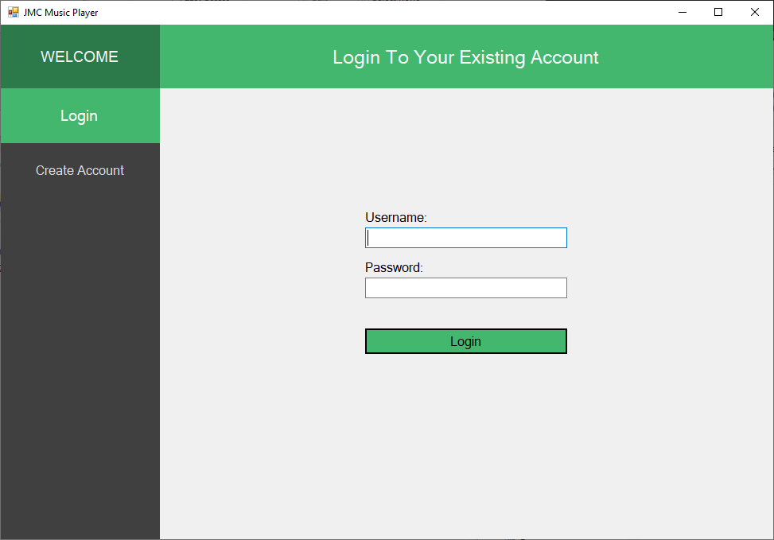
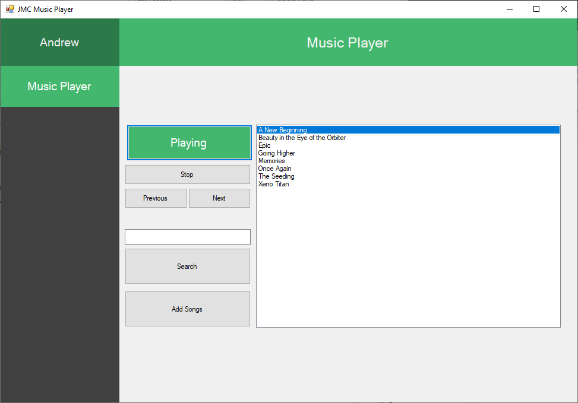
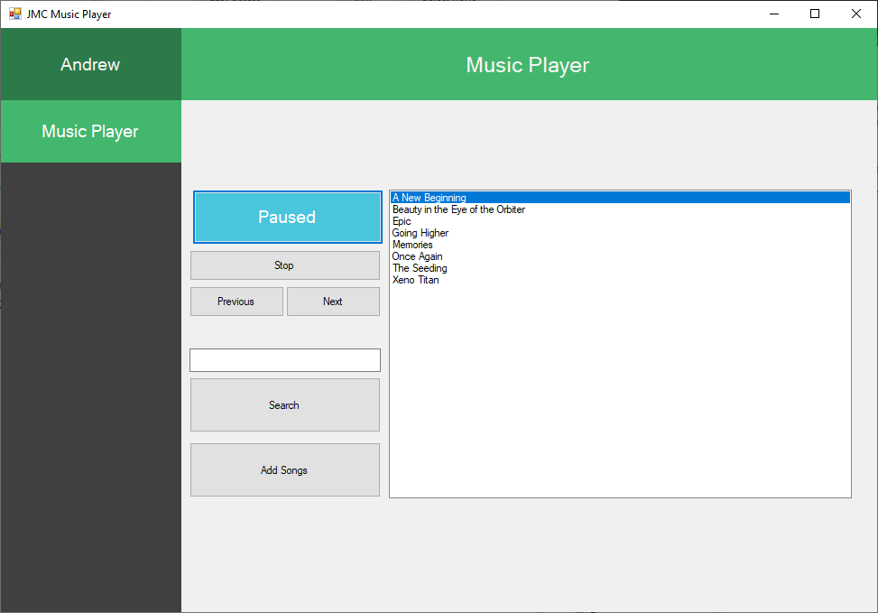
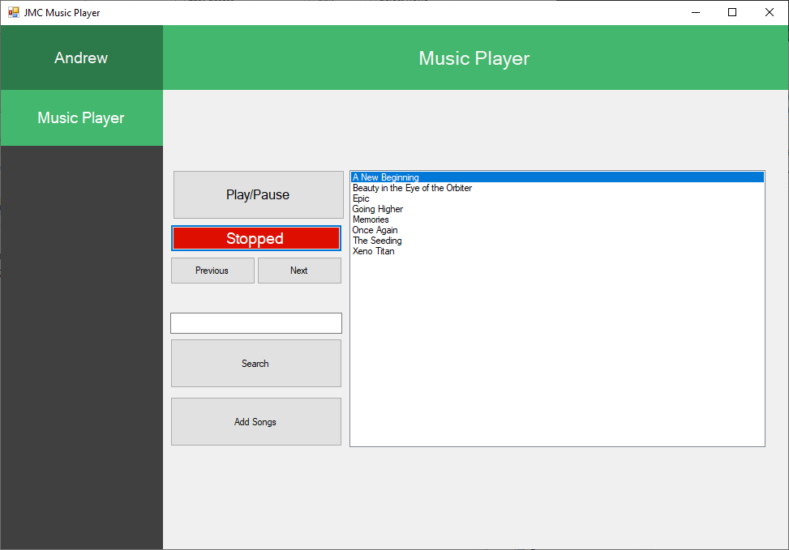

# Login Music Player

A client server app that requires you to login before you gain access to the build in music player.

## Quick Start Guide

Once the server is running you will be able to start the client where you will immediately see a login screen. If you do not have an account 
you can create one by navigating to the account creation page.

## Music Player

Once logged in the music player will appear and if your account already has a list of songs they will appear in the list.

 &nbsp; 

